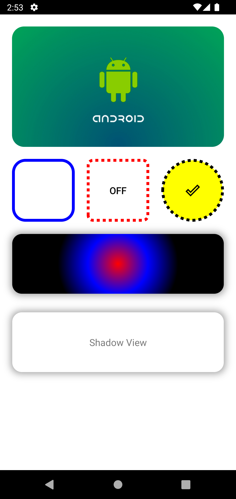

# ShapeView
[](https://jitpack.io/#dylan-kwon/ShapeView)

**ShapeView** is a view or layout that allows you to use the ShapeDrawable property immediately in the layout xml without creating a separate ShapeDrawable, and also supports CSS style shadow effects.

## Preview


## Install
### Project: build.gradle
```groovy
allprojects {
    repositories {
	    ...
	    maven { url 'https://jitpack.io' }
	}
}
```

### App: build.gradle
``` groovy
dependencies {
    implementation 'com.github.dylan-kwon:ShapeView:$latest-version'
}
```

### Provide components
1. ShapeFrameLayout
2. ShapeTextView
3. ShapeButton
4. ShapeToggleButton
5. ShapeRadioButton
6. ShapeCheckBox
7. ShapeImageView
8. ShapeImageButton
9. ShapeEditText
10. ShapeLinearLayout
11. ShapeConstraintLayout

### Attributes
```xml
<dylan.kwon.shapeview.component.ShapeFrameLayout
    android:layout_width="100dp"
    android:layout_height="100dp"

    android:clickable="true"
    android:focusable="true"

    app:solidColor="@color/white"
    app:strokeColor="@color/black"
    app:strokeWidth="5dp"
    app:strokeDashWidth="5dp"
    app:strokeDashGap="5dp"

    app:cornerRadius="8dp"

    app:useRipple="@color/red"
    app:rippleColor="@color/red"
    
    app:useClip="true"

    app:shadowBlur="10dp"
    app:shadowColor="@color/shadow"
    app:shadowInset="false"
    app:shadowSpread="2dp"
    app:shadow_x_offset="0dp"
    app:shadow_y_offset="0dp"

    app:gradientType="radial"
    app:gradientOrientation="LEFT_RIGHT"
    app:gradientStartColor="@color/red"
    app:gradientCenterColor="@color/blue"
    app:gradientEndColor="@color/black"
    app:gradientRadius="100dp"
    app:gradientX="0.5"
    app:gradientY="0.5" />

```

| name  | description  |
|---|---|
| app:solidColor  | Background color in enabled.  |
| app:strokeColor  | Stroke color in enabled.  |
| app:strokeWidth  | Stroke width in enabled.  |
| app:strokeDashWidth  | Stroke dash width in enabled.  |
| app:strokeDashGap  | Stroke dash gap in enabled.  |
| app:cornerRadius  | Radius in enabled.  |
| app:rippleColor  | Container ripple color.  |
| app:useRipple  | Whether to use ripple.  |
| app:useClip  | Whether to cut corner radius.  |
| app:shadowBlur  | Shadow blur.  |
| app:shadowColor  | Shadow color.  |
| app:shadowInset  | Shadow inset.  |
| app:shadowSpread  | Shadow spread.  |
| app:shadow_x_offset  | Shadow x offset.  |
| app:shadow_y_offset  | Shadow y offset.  |
| app:gradientType  | Gradient type.  |
| app:gradientOrientation  | Shadow orientation.  |
| app:gradientStartColor  | Gradient start color.  |
| app:gradientCenterColor  | Gradient center color. |
| app:gradientEndColor  | Gradient end color.  |
| app:gradientRadius  | Gradient radius.  |
| app:gradientX  | Gradient x position.  |
| app:gradientY  | Gradient y position.  |

